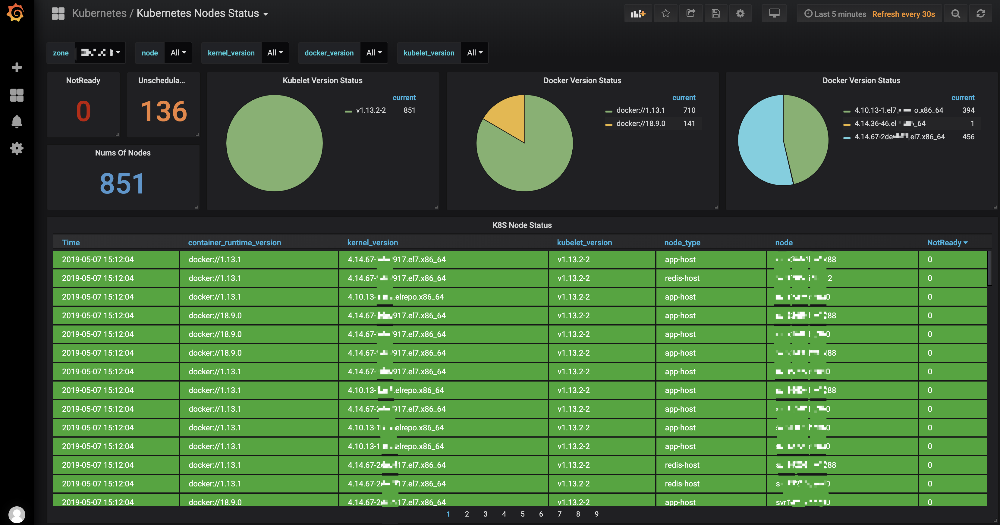

# grafana
share some cases of monitoring dadadada....
## prometheus-node_exporter
about monitoring node metrics.

## kubernetes-nodes  
about kubernetes nodes monitoring dashboard.
#### k8s-node-status
set refresh interval time as 30s

#### k8s-pod-status
set refresh interval time as 30s, which you can see the realtime change dynamically.

